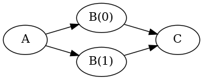

# <a name="userguide">Template Task Graph User Guide</a>

## <a name="toc">Contents</a>

* [Building and Installing TTG](https://github.com/TESSEorg/ttg/blob/master/INSTALL.md)
* [Your First TTG Program](#firstprog)
* [Compiling Your First TTG Program](#compiling)

## <a name="firstprog">Your First TTG Program</a>

The following code creates four tasks, one of type A, two of type B
(B(0) and B(1)), and one of type C, and ensures that A runs before
both B tasks, and that both B tasks run before C.

~~~~~~~~~~~~~{.cpp}
#include <ttg.h>

using namespace ttg;

static void a(std::tuple<Out<int, double>> &out) {
  ttg::print("Called task A");
  send<0>(0, 1.0, out);
  send<0>(1, 2.0, out);
}

static void b(const int &key, const double &input, std::tuple<Out<void, double>, Out<void, double>>&out) {
  ttg::print("Called task B(", key, ") with input data ", input);
  if(key == 0)
    sendv<0>(input+1.0, out);
  else
    sendv<1>(input+1.0, out);
}

static void c(const double &b0, const double &b1, std::tuple<> &out) {
  ttg::print("Called task C with inputs ", b0, " from B(0) and ", b1, " from B(1)");
}

int main(int argc, char **argv) {
  ttg::initialize(argc, argv, -1);

  {
    Edge<int, double> A_B("A->B");
    Edge<void, double> B_C0("B->C0");
    Edge<void, double> B_C1("B->C1");

    auto wa(make_tt<void>(a, edges(), edges(A_B), "A", {}, {"to B"}));
    auto wb(make_tt(b, edges(A_B), edges(B_C0, B_C1), "B", {"from A"}, {"to 1st input of C", "to 2nd input of C"}));
    auto wc(make_tt(c, edges(B_C0, B_C1), edges(), "C", {"From B", "From B"}, {}));

    wa->make_executable();
    wb->make_executable();
    wc->make_executable();

    if(wa->get_world().rank() == 0) wa->invoke();

    ttg::execute();
    ttg::fence(ttg::get_default_world());
  }

  ttg::finalize();
  return EXIT_SUCCESS;
}

~~~~~~~~~~~~~

## <a name="compiling">Compiling Your First TTG Program</a>

The recommended way to compile a TTG program is to use CMake.

Below, you will find a minimal CMakeLists.txt file to compile the first 
example above with both the PaRSEC and the MADNESS driver.

~~~~~~~~~~~~~{.cmake}
cmake_minimum_required(VERSION 3.19)
project(TTG-Example CXX)

find_package(ttg REQUIRED)

add_executable(first-parsec first.cc)
target_compile_definitions(first-parsec PRIVATE TTG_USE_PARSEC=1)
target_link_libraries(first-parsec PRIVATE ttg-parsec)

add_executable(first-mad first.cc)
target_compile_definitions(first-mad PRIVATE TTG_USE_MADNESS=1)
target_link_libraries(first-mad PRIVATE ttg-mad)
~~~~~~~~~~~~~

This CMakeLists.txt uses `find_package(ttg)` to define the different ttg targets.
`find_package` uses the `ttg_DIR` CMake variable as a hint where to find
configuration files. So, if you installed ttg in `/path/to/ttg`, you can point
`find_package` to the appropriate directory by calling CMake as follows:

~~~~~~~~~~~~~{.sh}
cd /path/to/your/builddir
cmake -Dttg_DIR=/path/to/ttg/lib/cmake/ttg /path/to/your/sourcedir
~~~~~~~~~~~~~

`find_package(ttg)` defines the following CMake targets:
  - `ttg-parsec`: the PaRSEC backend for TTG
  - `ttg-mad`: the MADNESS backend for TTG

When source code `#include <ttg.h>`, it needs to define which backend it uses.
In this example, we do that from the command line, by adding the compile-definition
`TTG_USE_PARSEC=1` or `TTG_USE_MADNESS=1`. 

It is then sufficient to tell CMake that the executable depends on the
corresponding TTG target to add the appropriate include path and link
commands.
